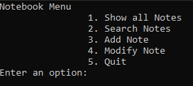

# Notebook

Notebook is a Python mini-program for writing down some notes.

## Installation and usage

Download repository and run the module "menu.py"

## Contributing
Pull requests are welcome. For major changes, please open an issue first to discuss what you would like to change.

## LICENSE
[GNU](https://github.com/hooloobooroodkoo/Film_map/blob/main/LICENSE)
